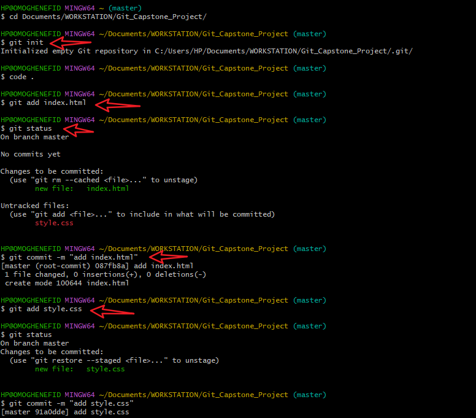
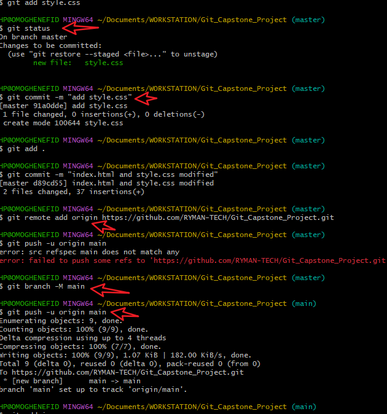
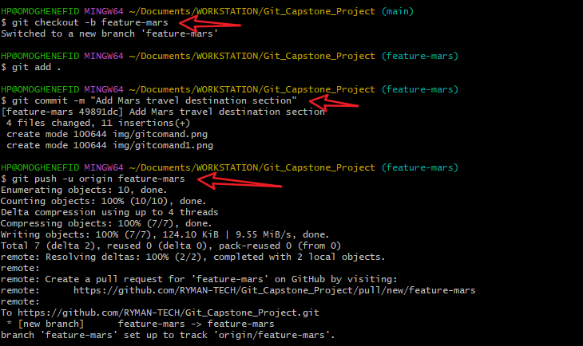
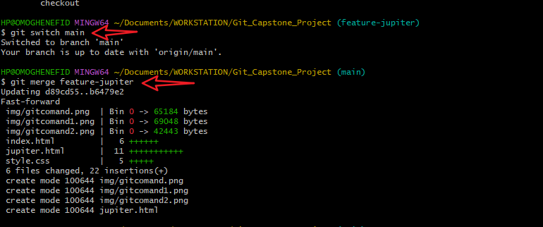
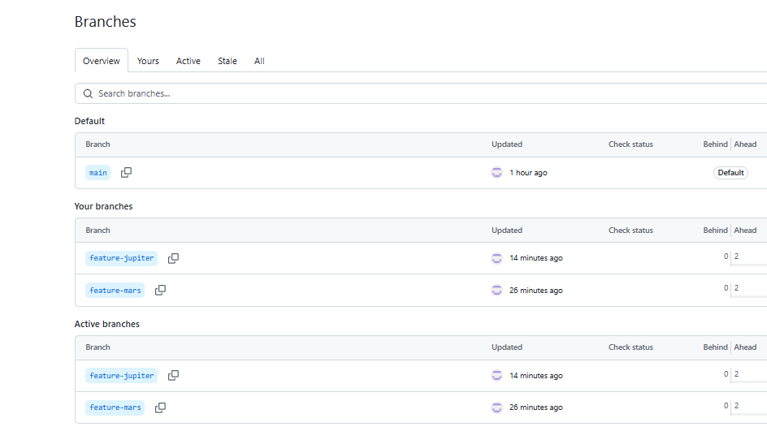

#  Overview

This collaborative project showcases our understanding of **Git version control** and **basic web technologies** (HTML & CSS).  
Through storytelling and teamwork, we built a branching narrative while applying Git concepts such as:

- Repository initialization
- Branch creation and management
- Merge operations
- Conflict resolution if any
- Push/pull workflows via GitHub

Below are images to show all the steps for this project.

